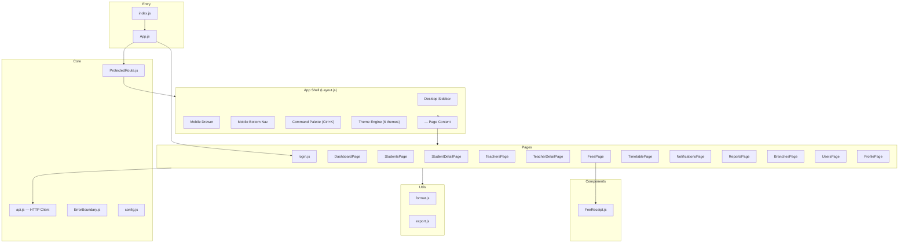
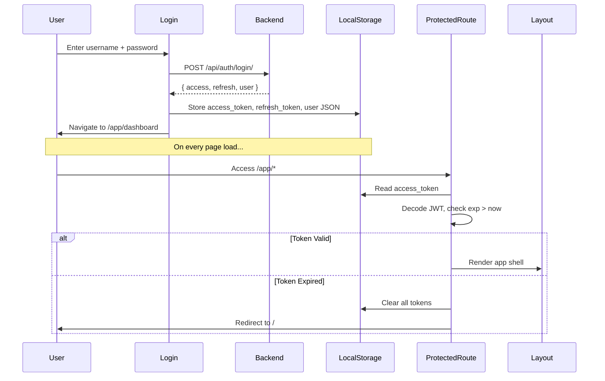

# Frontend Documentation — Eklavya Classes Management System

> **Stack**: React 19 · React Router 7 · React Bootstrap · Recharts · XLSX  
> **Entry Point**: `src/index.js` → `src/App.js`  
> **Dev Server**: `npm start` (Create React App, port 3000)

---

## 1. Architecture Overview

---

## 2. Routing Map

All authenticated routes are nested under `/app` and wrapped in `<ProtectedRoute>` → `<Layout>`.

| Route | Component | Description |
|:---|:---|:---|
| `/` | `Login` | Login page (public) |
| `/app/dashboard` | `DashboardPage` | KPI cards, charts, test reminders |
| `/app/students` | `StudentsPage` | Student CRUD, search, filters, export |
| `/app/students/:id` | `StudentDetailPage` | Individual student profile + payments |
| `/app/teachers` | `TeachersPage` | Teacher CRUD, search, export |
| `/app/teachers/:id` | `TeacherDetailPage` | Individual teacher profile |
| `/app/fees` | `FeesPage` | Revenue dashboard, payment CRUD, receipt print |
| `/app/timetable` | `TimetablePage` | Weekly timetable view with filters |
| `/app/notifications` | `NotificationsPage` | In-app notification feed |
| `/app/reports` | `ReportsPage` | Fee collection reports |
| `/app/branches` | `BranchesPage` | Branch CRUD |
| `/app/users` | `UsersPage` | User management (Owner/Admin only) |
| `/app/profile` | `ProfilePage` | Edit profile, change password |
| `*` | Redirect → `/` | Catch-all redirect |

---

## 3. Authentication Flow

### Token Management
- **Storage**: `localStorage` (keys: `access_token`, `refresh_token`, `user`)
- **Token Lifetime**: Access = 60 minutes, Refresh = 1 day
- **Auto-Refresh**: `api.js` has a `handle401()` function that attempts token refresh on 401 responses using `/api/token/refresh/`
- **Logout**: `clearSession()` removes all localStorage keys → redirect to `/`

### Role Helpers (`api.js`)
| Function | Returns `true` when |
|:---|:---|
| `isAdmin()` | `role === 'admin' OR 'owner' OR is_superuser` |
| `isOwner()` | `role === 'owner' OR is_superuser` |
| `canManageUsers()` | `role === 'owner' OR 'admin' OR is_superuser` |

### Server-Side Role Re-validation
On app load, `Layout.js` silently fetches `/auth/profile/` and compares the server's role with localStorage. If they differ, it updates localStorage to prevent client-side role spoofing.

---

## 4. API Client (`api.js`)

The HTTP client is a thin wrapper around `fetch()`.

| Function | Signature | Purpose |
|:---|:---|:---|
| `fetchJson` | `(path, options?) → Promise<data>` | Core fetch with JWT headers, 401 handling, error parsing |
| `postJson` | `(path, body) → Promise<data>` | POST with JSON body |
| `putJson` | `(path, body) → Promise<data>` | PUT with JSON body |
| `deleteJson` | `(path) → Promise<data>` | DELETE request |
| `fetchList` | `(path, options?) → Promise<array>` | Handles both paginated `{results}` and plain array responses |
| `getAuthHeaders` | `() → object` | Returns `Authorization: Bearer <token>` header |

**Base URL**: Configured in `config.js` → `process.env.REACT_APP_API_URL || 'http://localhost:8000/api'`

**Error Handling**: Parses DRF error responses (field-level errors, `detail`, `error` keys) and throws a single `Error` with combined messages.

---

## 5. App Shell (`Layout.js`)

The layout provides the persistent navigation chrome around all authenticated pages.

### Features
| Feature | Implementation |
|:---|:---|
| **Desktop Sidebar** | Fixed left sidebar with nav links, theme selector, sign-out |
| **Mobile Hamburger Drawer** | Slide-out drawer triggered by hamburger icon (visible `< 992px`) |
| **Mobile Bottom Nav** | Fixed bottom bar showing first 5 pages (Dashboard, Students, Teachers, Timetable, Fees) |
| **Command Palette** | `Ctrl+K` opens a search modal. Searches pages by name + calls `/api/search/?q=` for data |
| **Theme System** | 6 themes stored in `localStorage('eklavya-theme')`, applied via `document.documentElement.dataset.theme` |
| **Notification Badge** | Fetches `/notifications/` on load, shows unread count on sidebar + mobile header |
| **Users Link Guard** | The "Users" nav item is only shown when `canManageUsers()` returns true |

### Available Themes
1. Modern Azure (default)
2. Midnight Pro
3. Royal Velvet
4. Crimson Sunset
5. Emerald Forest
6. Cyberpunk Neon

---

## 6. Page-by-Page Breakdown

### 6.1 Login Page (`login.js`)
- **Form Fields**: Username, Password (with show/hide toggle)
- **Action**: `POST /api/auth/login/` → stores tokens → navigates to `/app/dashboard`
- **Styling**: Dedicated `login.css` with watermark logo background
- **Validation**: Client-side empty-field check

### 6.2 Dashboard Page (`DashboardPage.js`)
- **API Calls** (parallel on mount):
  - `GET /dashboard/stats/` → KPI cards
  - `GET /dashboard/test-reminders/` → Upcoming tests (7-day window)
  - `GET /reports/fees/` → Revenue numbers
- **UI Sections**:
  - 4 KPI stat cards (Students, Teachers, Branches, Revenue) with sparkline charts
  - Weekly Revenue Trend (AreaChart)
  - Collection Rate donut (PieChart)
  - Upcoming Tests grid

### 6.3 Students Page (`StudentsPage.js`)
- **API Calls**: `GET /students/?name=&standard=&branch=`
- **CRUD Actions** (Admin only):
  - Create: `POST /students/` (with initial payment auto-creation)
  - Edit: `PUT /students/:id/`
  - Delete: `DELETE /students/:id/`
- **Features**:
  - Search by name, standard, branch
  - Desktop table view + mobile card view
  - KPI stats (total, active, expected revenue, pending fees)
  - Export to Excel via `xlsx` library
  - Client-side validation (name min 2 chars, phone format, fee non-negative)
  - Predefined standard list (Class 1–12, NEET, JEE, Foundation)
  - Predefined batch time slots

### 6.4 Student Detail Page (`StudentDetailPage.js`)
- **API Calls**:
  - `GET /students/:id/` → Student profile
  - `GET /finance/payments/?student=:id` → Payment history
- **Displays**: Personal details card + recent payments table

### 6.5 Teachers Page (`TeachersPage.js`)
- **API Calls**: `GET /teachers/`
- **CRUD Actions** (Admin only): Create, Edit, Delete
- **Features**:
  - Desktop table + mobile card view
  - Export to Excel
  - Client-side validation (name, email format, phone format, subject required)
  - Predefined subject list (17 subjects)

### 6.6 Fees Page (`FeesPage.js`)
- **API Calls**:
  - `GET /finance/payments/?branch=&standard=&batch=`
  - `GET /reports/fees/?branch=&standard=&batch=`
  - `GET /students/` → For payment form student dropdown
  - `GET /branches/` → For filter dropdown
- **Features**:
  - Power BI-style left filter pane (Branch, Standard, Batch Time, Search)
  - 4 KPI cards (Collected, Expected, Efficiency, Pending)
  - Revenue Collection Timeline (AreaChart)
  - Payment Modes breakdown (PieChart)
  - Transaction Ledger table
  - Record Payment modal (Admin only)
  - Print receipt button → triggers `window.print()` with `FeeReceipt` component
  - Export to Excel
  - Dynamic batch options computed from filtered students

### 6.7 Timetable Page (`TimetablePage.js`)
- **API Calls**: `GET /schedule/timetable/?standard=&batch_time=&branch=`
- **Display**: Grouped by day of week (Mon–Sat), each day shows table (desktop) or cards (mobile)
- **Filters**: Standard, Batch/Time, Branch

### 6.8 Notifications Page (`NotificationsPage.js`)
- **API Calls**: `GET /notifications/`
- **Actions**: Mark as read via `POST /notifications/:id/mark-read/`
- **Display**: Unread notifications highlighted with primary background, relative timestamps ("5m ago")

### 6.9 Reports Page (`ReportsPage.js`)
- **API Calls**: `GET /reports/fees/`
- **Display**: 4 KPI cards + Collection Progress bar + Detailed Breakdown list

### 6.10 Branches Page (`BranchesPage.js`)
- **API Calls**: `GET /branches/`
- **CRUD Actions** (Admin only): Create, Edit, Delete
- **Fields**: Name, Code (unique), Address, City, Active/Inactive toggle

### 6.11 Users Page (`UsersPage.js`)
- **Access Control**: Only shown when `canManageUsers()` is true
- **API Calls**: `GET /auth/users/`, `GET /branches/`
- **CRUD Actions**:
  - Owner: Create users with any role (owner, admin, assistant)
  - Admin: Create only assistant users in their own branch
  - Delete: Owner can delete anyone; Admin can delete assistants in their branch
- **Form Fields**: Username, Email, First Name, Last Name, Role, Branch, Password + Confirm

### 6.12 Profile Page (`ProfilePage.js`)
- **API Calls**: `GET /auth/profile/`
- **Actions**:
  - Update profile: `PUT /auth/profile/update/` (first name, last name, email)
  - Change password: `POST /auth/change-password/` (old + new + confirm)
- **Features**:
  - Avatar with initials
  - Role badge (color-coded: Owner=amber, Admin=indigo, Assistant=slate)
  - Password strength meter (Weak/Medium/Strong based on length, uppercase, numbers, symbols)

---

## 7. Shared Components & Utilities

### FeeReceipt (`components/FeeReceipt.js`)
- Print-only component using CSS `@media print` to hide everything else
- Displays: Header (EKLAVYA branding), receipt ID, date, student details, payment breakdown, total highlight, signature line

### Export Utility (`utils/export.js`)
- Lazy-loads `xlsx` library
- `exportToExcel(rows, cols, name)` → generates `.xlsx` file with auto-width columns
- Pre-defined column configs: `STUDENT_COLS`, `TEACHER_COLS`, `PAYMENT_COLS`

### Format Utility (`utils/format.js`)
- `formatCurrency(n)` → Indian numbering format (e.g., `3,00,000`)
- `formatINR(n)` → `₹3,00,000`

### Error Boundary (`ErrorBoundary.js`)
- React class component that catches render errors
- Shows friendly error UI with "Try Again" button
- In development mode, shows expandable error details

---

## 8. State Management

The app uses **no global state library** (no Redux, no Context API). State is managed at the page level:

- **Authentication state**: `localStorage` (tokens + user object)
- **Page data**: Each page fetches its own data via `useEffect` + `useState`
- **Theme**: `localStorage('eklavya-theme')` → applied via CSS custom properties on `<html>`
- **Navigation**: React Router's `useNavigate`, `useLocation`, `useParams`

---

## 9. Styling System

- **Global styles**: `src/index.css` (31KB — comprehensive design system)
- **Login styles**: `src/login.css` (dedicated login page)
- **Page-specific**: `BranchesPage.css`, `FeesPage.css`
- **Approach**: CSS custom properties (CSS variables) per theme, applied via `[data-theme="..."]` selectors
- **Framework**: Bootstrap 5 for grid, badges, forms. Custom glassmorphism cards.
- **Animations**: `animate-fade-in`, `hover-lift`, `pulse-primary`

---

## 10. Dependencies

| Package | Version | Purpose |
|:---|:---|:---|
| `react` | 19.2.5 | UI framework |
| `react-dom` | 19.2.5 | DOM renderer |
| `react-router-dom` | 7.14.2 | Client-side routing |
| `bootstrap` | 5.3.8 | CSS framework |
| `react-bootstrap` | 2.10.10 | Bootstrap React components |
| `recharts` | 3.8.1 | Chart library (Area, Pie charts) |
| `xlsx` | 0.18.5 | Excel export (lazy-loaded) |
| `react-scripts` | 5.0.1 | Create React App build tooling |
