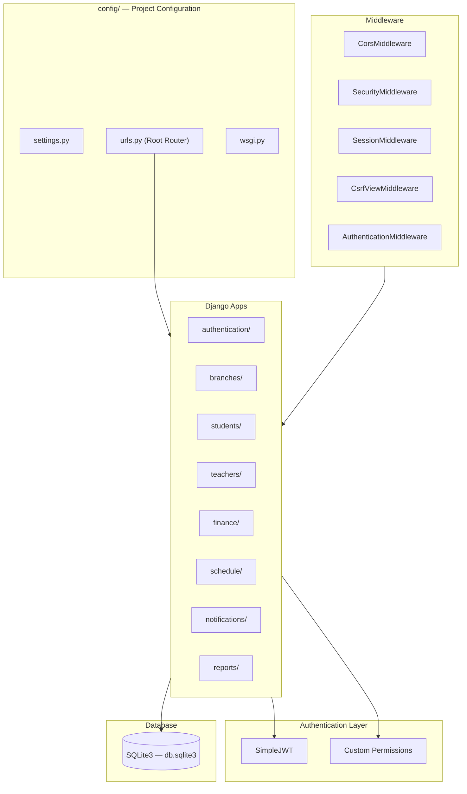
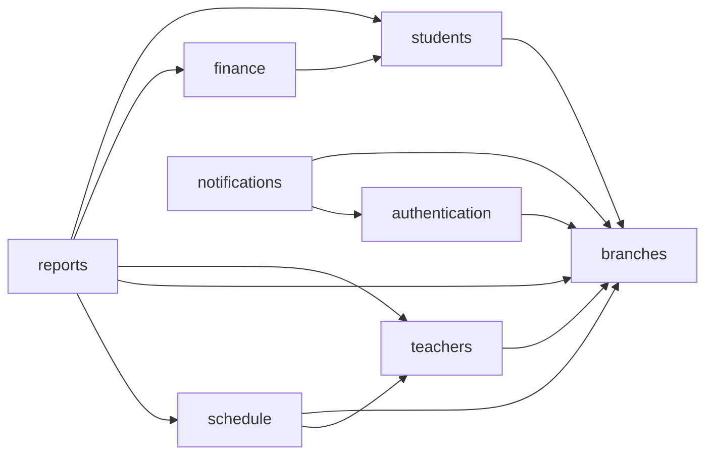
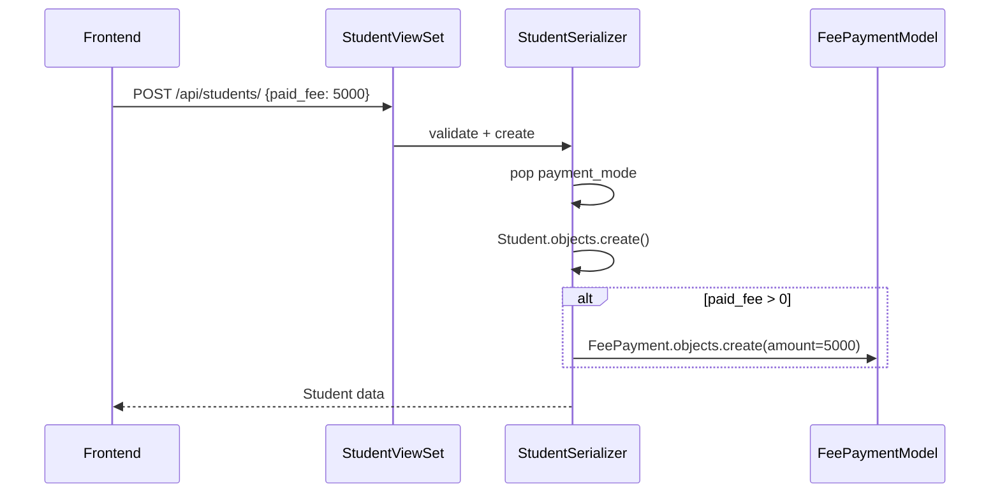
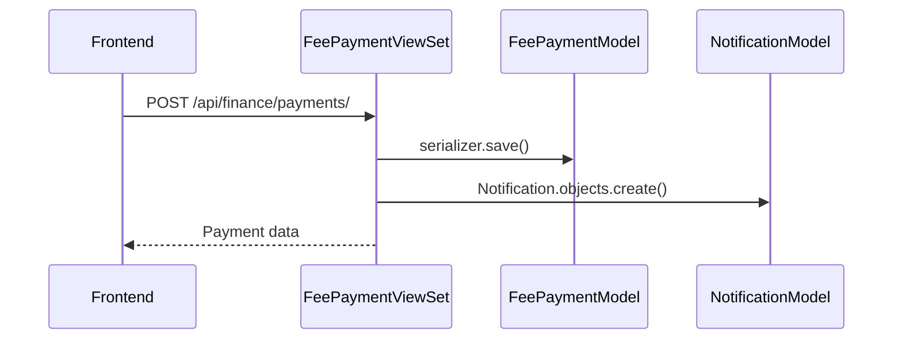

# Backend Documentation — Eklavya Classes Management System

> **Stack**: Django 4.2 · Django REST Framework 3.14 · SimpleJWT · SQLite3  
> **Entry Point**: `backend/manage.py` → `backend/config/`  
> **Dev Server**: `python manage.py runserver 8000`

---

## 1. Architecture Overview



### Module Dependency Graph



---

## 2. Configuration (`config/settings.py`)

### Key Settings

| Setting | Value | Notes |
|:---|:---|:---|
| `SECRET_KEY` | From `.env` | Falls back to insecure default |
| `DEBUG` | From `.env` (default `False`) | Enables CORS_ALLOW_ALL when True |
| `AUTH_USER_MODEL` | `authentication.User` | Custom user model |
| `DEFAULT_AUTHENTICATION` | `JWTAuthentication` | All endpoints require JWT by default |
| `DEFAULT_PERMISSION` | `IsAuthenticated` | All endpoints require auth by default |
| `PAGE_SIZE` | 50 | Default pagination |
| `ACCESS_TOKEN_LIFETIME` | 60 minutes | JWT access token |
| `REFRESH_TOKEN_LIFETIME` | 1 day | JWT refresh token |
| `ANON_THROTTLE` | 20/minute | Rate limiting for unauthenticated requests |
| `USER_THROTTLE` | 200/minute | Rate limiting for authenticated requests |

### Security Headers (Production)
When `DEBUG=False`, the following are automatically enabled:
- `SECURE_BROWSER_XSS_FILTER`
- `SECURE_CONTENT_TYPE_NOSNIFF`
- `X_FRAME_OPTIONS = 'DENY'`
- `SECURE_HSTS_SECONDS = 31536000` (1 year)
- `SESSION_COOKIE_SECURE`
- `CSRF_COOKIE_SECURE`

### CORS
- In DEBUG: `CORS_ALLOW_ALL_ORIGINS = True`
- In Production: Only origins listed in `CORS_ALLOWED_ORIGINS` env variable
- `CORS_ALLOW_CREDENTIALS = True` always

### Installed Apps
1. `rest_framework` — DRF
2. `rest_framework_simplejwt` — JWT auth
3. `corsheaders` — CORS handling
4. `drf_spectacular` — OpenAPI/Swagger auto-docs
5. `authentication`, `branches`, `students`, `teachers`, `finance`, `schedule`, `notifications`, `reports` — Domain apps

### Python Dependencies (`requirements.txt`)
| Package | Version | Purpose |
|:---|:---|:---|
| Django | 4.2.11 | Web framework |
| djangorestframework | 3.14.0 | REST API framework |
| djangorestframework-simplejwt | 5.3.1 | JWT authentication |
| django-cors-headers | 4.3.1 | CORS middleware |
| python-decouple | 3.8 | Environment variable management |
| Pillow | ≥10.2.0 | Image processing (unused currently) |
| drf-spectacular | ≥0.27.0 | OpenAPI schema generation |

---

## 3. URL Routing (`config/urls.py`)

All API routes are prefixed with `/api/`.

| URL Prefix | Include | App |
|:---|:---|:---|
| `/api/auth/` | `authentication.urls` | Auth, users, profile |
| `/api/branches/` | `branches.urls` | Branch CRUD |
| `/api/students/` | `students.urls` | Student CRUD + CSV import |
| `/api/teachers/` | `teachers.urls` | Teacher CRUD |
| `/api/finance/` | `finance.urls` | Fee payment CRUD |
| `/api/schedule/` | `schedule.urls` | Timetable + Test schedule CRUD |
| `/api/notifications/` | `notifications.urls` | Notification CRUD |
| `/api/` | `reports.urls` | Dashboard stats, reports, search |
| `/api/token/refresh/` | SimpleJWT | Token refresh |
| `/api/schema/` | drf-spectacular | OpenAPI schema (JSON) |
| `/api/docs/` | drf-spectacular | Swagger UI |
| `/api/redoc/` | drf-spectacular | ReDoc UI |
| `/admin/` | Django Admin | Admin panel |

---

## 4. Complete Endpoint Reference

### 4.1 Authentication (`/api/auth/`)

| Method | Endpoint | Auth | Permission | Description |
|:---|:---|:---|:---|:---|
| `POST` | `/api/auth/login/` | ❌ None | AllowAny | Login with username/password → returns JWT tokens + user |
| `POST` | `/api/auth/register/` | ✅ JWT | Owner/Admin | Register new user (admin-only) |
| `GET` | `/api/auth/profile/` | ✅ JWT | Authenticated | Get current user profile |
| `PUT` | `/api/auth/profile/update/` | ✅ JWT | Authenticated | Update own profile (name, email) |
| `POST` | `/api/auth/change-password/` | ✅ JWT | Authenticated | Change own password |
| `POST` | `/api/auth/logout/` | ✅ JWT | Authenticated | Logout (creates audit log) |
| `GET` | `/api/auth/health/` | ❌ None | AllowAny | Health check |
| `GET` | `/api/auth/users/` | ✅ JWT | UserManagementPermission | List users |
| `POST` | `/api/auth/users/` | ✅ JWT | UserManagementPermission | Create user |
| `GET` | `/api/auth/users/:id/` | ✅ JWT | UserManagementPermission | Get user detail |
| `PUT` | `/api/auth/users/:id/` | ✅ JWT | UserManagementPermission | Update user |
| `DELETE` | `/api/auth/users/:id/` | ✅ JWT | UserManagementPermission | Delete user |

### 4.2 Branches (`/api/branches/`)

| Method | Endpoint | Auth | Permission | Description |
|:---|:---|:---|:---|:---|
| `GET` | `/api/branches/` | ✅ JWT | Authenticated | List branches (scoped by user's branch) |
| `POST` | `/api/branches/` | ✅ JWT | Owner/Admin | Create branch |
| `GET` | `/api/branches/:id/` | ✅ JWT | Authenticated | Get branch detail |
| `PUT` | `/api/branches/:id/` | ✅ JWT | Owner/Admin | Update branch |
| `DELETE` | `/api/branches/:id/` | ✅ JWT | Owner/Admin | Delete branch (fails if has related data) |

### 4.3 Students (`/api/students/`)

| Method | Endpoint | Auth | Query Params | Description |
|:---|:---|:---|:---|:---|
| `GET` | `/api/students/` | ✅ JWT | `branch`, `standard`, `name` | List students (branch-scoped) |
| `POST` | `/api/students/` | ✅ JWT | — | Create student (auto-creates FeePayment if paid_fee > 0) |
| `GET` | `/api/students/:id/` | ✅ JWT | — | Get student detail |
| `PUT` | `/api/students/:id/` | ✅ JWT | — | Update student |
| `DELETE` | `/api/students/:id/` | ✅ JWT | — | Delete student |
| `GET` | `/api/students/:id/fees/` | ✅ JWT | — | Get student's fee payment history |
| `POST` | `/api/students/import/` | ✅ JWT | — | Bulk CSV import |

**CSV Import Validations**:
- Max file size: 5 MB
- File extension: `.csv` only
- Encoding: UTF-8
- Returns: `{ created_count, skipped_count, errors[] }`

### 4.4 Teachers (`/api/teachers/`)

| Method | Endpoint | Auth | Query Params | Description |
|:---|:---|:---|:---|:---|
| `GET` | `/api/teachers/` | ✅ JWT | `branch` | List teachers (branch-scoped) |
| `POST` | `/api/teachers/` | ✅ JWT | — | Create teacher |
| `GET` | `/api/teachers/:id/` | ✅ JWT | — | Get teacher detail |
| `PUT` | `/api/teachers/:id/` | ✅ JWT | — | Update teacher |
| `DELETE` | `/api/teachers/:id/` | ✅ JWT | — | Delete teacher |

### 4.5 Finance (`/api/finance/`)

| Method | Endpoint | Auth | Query Params | Description |
|:---|:---|:---|:---|:---|
| `GET` | `/api/finance/payments/` | ✅ JWT | `branch`, `standard`, `batch`, `student` | List fee payments (branch-scoped) |
| `POST` | `/api/finance/payments/` | ✅ JWT | — | Record new payment (auto-creates notification) |
| `GET` | `/api/finance/payments/:id/` | ✅ JWT | — | Get payment detail |
| `PUT` | `/api/finance/payments/:id/` | ✅ JWT | — | Update payment |
| `DELETE` | `/api/finance/payments/:id/` | ✅ JWT | — | Delete payment |

**Side Effect**: When a payment is created, a `Notification` is auto-created:
- Title: `Fee payment recorded for {student_name}`
- Message: `₹{amount} was added for {student_name} on {date}`
- Type: `system`, Target: `all`

### 4.6 Schedule (`/api/schedule/`)

| Method | Endpoint | Auth | Query Params | Description |
|:---|:---|:---|:---|:---|
| `GET` | `/api/schedule/timetable/` | ✅ JWT | `branch`, `standard`, `batch_time`, `teacher` | List timetable slots |
| `POST` | `/api/schedule/timetable/` | ✅ JWT | — | Create timetable slot |
| `PUT` | `/api/schedule/timetable/:id/` | ✅ JWT | — | Update timetable slot |
| `DELETE` | `/api/schedule/timetable/:id/` | ✅ JWT | — | Delete timetable slot |
| `GET` | `/api/schedule/tests/` | ✅ JWT | `branch` | List test schedules |
| `POST` | `/api/schedule/tests/` | ✅ JWT | — | Create test schedule |
| `PUT` | `/api/schedule/tests/:id/` | ✅ JWT | — | Update test schedule |
| `DELETE` | `/api/schedule/tests/:id/` | ✅ JWT | — | Delete test schedule |

### 4.7 Notifications (`/api/notifications/`)

| Method | Endpoint | Auth | Permission | Description |
|:---|:---|:---|:---|:---|
| `GET` | `/api/notifications/` | ✅ JWT | Scoped by role | List notifications |
| `POST` | `/api/notifications/` | ✅ JWT | Admin+ | Create notification |
| `POST` | `/api/notifications/:id/mark-read/` | ✅ JWT | Own/Admin | Mark notification as read |

**Notification Scoping**: Non-admin users only see notifications where:
- `recipient = current_user` OR
- `target_role = 'all'` OR
- `target_role = user's role` OR
- `branch = user's branch`

### 4.8 Dashboard & Reports (`/api/`)

| Method | Endpoint | Auth | Query Params | Description |
|:---|:---|:---|:---|:---|
| `GET` | `/api/dashboard/stats/` | ✅ JWT | — | Comprehensive stats (students, teachers, branches, revenue) |
| `GET` | `/api/dashboard/student-status/` | ✅ JWT | — | Active/pending fee student counts |
| `GET` | `/api/dashboard/test-reminders/` | ✅ JWT | — | Tests in next 7 days |
| `GET` | `/api/reports/fees/` | ✅ JWT | `branch`, `standard`, `batch` | Fee revenue report (expected vs collected vs pending) |
| `GET` | `/api/reports/timetable/` | ✅ JWT | — | Timetable summary grouped by standard + day |
| `GET` | `/api/search/?q=` | ✅ JWT | `q` | Global search across students, teachers, payments |

### 4.9 Token & Docs

| Method | Endpoint | Auth | Description |
|:---|:---|:---|:---|
| `POST` | `/api/token/refresh/` | ❌ (needs refresh token) | Refresh access token |
| `GET` | `/api/schema/` | — | OpenAPI JSON schema |
| `GET` | `/api/docs/` | — | Swagger UI |
| `GET` | `/api/redoc/` | — | ReDoc documentation |

---

## 5. Permission System

### 5.1 Role Hierarchy

```
Owner (highest)
  └── Admin
       └── Assistant (lowest)
```

### 5.2 Custom Permission Classes

#### `UserManagementPermission` (authentication app)
| Role | List Users | View User | Create User | Edit User | Delete User |
|:---|:---|:---|:---|:---|:---|
| **Owner** | All users | Any user | Any role | Any user | Any user |
| **Admin** | Same-branch users | Same-branch | Assistant only, own branch | Same-branch assistants | Same-branch assistants |
| **Assistant** | Own profile only | Own profile | ❌ | ❌ | ❌ |

#### `BranchManagePermission` (branches app)
| Role | Read | Create/Update/Delete |
|:---|:---|:---|
| **Owner/Admin** | All branches | ✅ Yes |
| **Assistant** | Own branch only | ❌ No |

#### `NotificationPermission` (notifications app)
| Role | Read | Create | Mark Read |
|:---|:---|:---|:---|
| **Admin+** | All notifications | ✅ Yes | ✅ Yes |
| **Other** | Own + targeted + branch-level | ❌ No | Own only |

### 5.3 Branch-Scoping Pattern

All ViewSets follow this consistent pattern in `get_queryset()`:
```python
def get_queryset(self):
    if self.request.user.is_superuser:
        # Superusers see everything; optionally filter by ?branch=
        return queryset.filter(branch_id=branch_id) if branch_id else queryset
    
    if hasattr(self.request.user, 'branch') and self.request.user.branch:
        # Non-superusers are locked to their assigned branch
        return queryset.filter(branch=self.request.user.branch)
    
    # Fallback: filter by query param if no branch assignment
    return queryset
```

---

## 6. Data Flow Patterns

### 6.1 Student Creation with Initial Payment


### 6.2 Fee Payment with Auto-Notification


### 6.3 User Action Audit Logging
All user management operations (create, update, delete, login, logout, password change) automatically create a `UserActionLog` entry with:
- `actor` — Who performed the action
- `target_user` — Who was affected
- `action` — Type of action (create/update/delete/login/logout/password_change)
- `details` — Human-readable description
- `timestamp` — Auto-generated

---

## 7. Serializer Summary

| Serializer | Model | Key Features |
|:---|:---|:---|
| `UserSerializer` | User | Read-only, includes `branch_name` |
| `UserManagementSerializer` | User | Write, handles password hashing + confirmation |
| `RegisterSerializer` | User | Create-only, validates unique username/email |
| `LoginSerializer` | — | Validates credentials via `authenticate()` |
| `ChangePasswordSerializer` | — | Validates old password + new password match |
| `BranchSerializer` | Branch | Standard CRUD |
| `StudentSerializer` | Student | Includes computed `fee_left`, auto-creates `FeePayment` on create |
| `TeacherSerializer` | Teacher | Includes `branch_name` |
| `FeePaymentSerializer` | FeePayment | Includes nested student name, branch, standard, batch |
| `TimetableSlotSerializer` | TimetableSlot | Includes `teacher_name` |
| `TestScheduleSerializer` | TestSchedule | Standard CRUD |
| `NotificationSerializer` | Notification | Includes `branch_name`, `recipient_username` |

---

## 8. Management Commands

Located in `authentication/management/`:
- **`create_default_admin`**: Creates an initial superuser with `owner` role. On subsequent runs, prints existing credentials.
- Used by `run.py` (root setup script) for automated onboarding.

---

## 9. Global Search (`/api/search/?q=`)

Searches across 3 entities simultaneously (branch-scoped for non-superusers):

| Entity | Searched Fields | Max Results | Link Path |
|:---|:---|:---|:---|
| Students | `name`, `contact_number`, `roll_number` | 10 | `/students` |
| Teachers | `name`, `subject` | 5 | `/teachers` |
| Fee Payments | `reference`, `student.name` | 5 | `/fees` |

---

## 10. API Documentation

Auto-generated OpenAPI 3.0 schema via `drf-spectacular`:
- **Schema**: `GET /api/schema/` (JSON/YAML)
- **Swagger UI**: `GET /api/docs/`
- **ReDoc**: `GET /api/redoc/`

---

## 11. Known Mock Data in Production Code

The `ComprehensiveDashboardStatsView` returns hardcoded values for:
- `total_courses: 8` (no Course model exists)
- `attendance_percent: 95` (no Attendance model exists)
- `results_percent: 90` (no Results model exists)
- `total_staff: total_teachers + 5` (arbitrary addition)

These are placeholder values since Attendance and Results modules have not been built yet.
