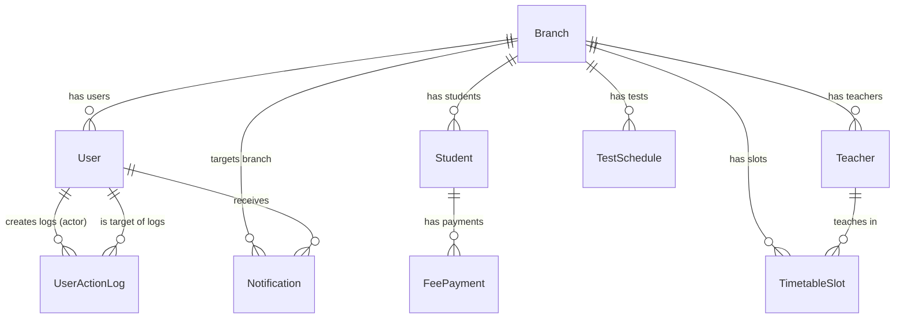

# Database Documentation — Eklavya Classes Management System

> **Engine**: SQLite3 (Development) — recommended: PostgreSQL for production  
> **File**: `backend/db.sqlite3`  
> **ORM**: Django ORM with `BigAutoField` as default primary key

---

## 1. Database Configuration

```python
# backend/config/settings.py
DATABASES = {
    'default': {
        'ENGINE': 'django.db.backends.sqlite3',
        'NAME': BASE_DIR / 'db.sqlite3',
    }
}

DEFAULT_AUTO_FIELD = 'django.db.models.BigAutoField'
AUTH_USER_MODEL = 'authentication.User'
```

### Environment
- **Timezone**: `UTC` (with `USE_TZ = True` — all timestamps are timezone-aware)
- **Migrations**: Each app has its own `migrations/` directory
- **Pagination**: Default 50 records per page (server-side)

---

## 2. Entity Relationship Diagram



---

## 3. Complete Schema — Table by Table

### 3.1 `branches_branch`

The **root entity** of the system. All operational data (students, teachers, schedules) is partitioned by branch.

| Column | Type | Constraints | Description |
|:---|:---|:---|:---|
| `id` | `BigAutoField` | PK, auto-increment | Primary key |
| `name` | `CharField(120)` | UNIQUE, NOT NULL | Branch display name |
| `code` | `CharField(24)` | UNIQUE, NOT NULL | Short identifier code |
| `address` | `TextField` | BLANK allowed | Full postal address |
| `city` | `CharField(80)` | BLANK allowed | City name |
| `is_active` | `BooleanField` | DEFAULT `True` | Operational status |
| `created_at` | `DateTimeField` | AUTO_NOW_ADD | Record creation timestamp |
| `updated_at` | `DateTimeField` | AUTO_NOW | Last modification timestamp |

**Ordering**: `name` ASC  
**Delete Protection**: `PROTECT` — Cannot delete if referenced by students, teachers, or schedules.

---

### 3.2 `authentication_user`

Extends Django's `AbstractUser`. Custom fields added for role-based access and branch assignment.

| Column | Type | Constraints | Description |
|:---|:---|:---|:---|
| `id` | `BigAutoField` | PK | Primary key |
| `username` | `CharField(150)` | UNIQUE, NOT NULL | Login username (inherited) |
| `password` | `CharField(128)` | NOT NULL | Hashed password (inherited) |
| `email` | `EmailField` | UNIQUE, NOT NULL | Email address |
| `first_name` | `CharField(150)` | BLANK allowed | First name (inherited) |
| `last_name` | `CharField(150)` | BLANK allowed | Last name (inherited) |
| `is_active` | `BooleanField` | DEFAULT `True` | Account active (inherited) |
| `is_staff` | `BooleanField` | DEFAULT `False` | Admin site access (inherited) |
| `is_superuser` | `BooleanField` | DEFAULT `False` | Superuser flag (inherited) |
| `date_joined` | `DateTimeField` | AUTO | Join date (inherited) |
| `last_login` | `DateTimeField` | NULLABLE | Last login (inherited) |
| `role` | `CharField(24)` | DEFAULT `'assistant'` | `owner` / `admin` / `assistant` |
| `branch_id` | `BigInt FK` | NULLABLE, SET_NULL | FK → `branches_branch.id` |
| `created_at` | `DateTimeField` | AUTO_NOW_ADD | Record creation timestamp |
| `updated_at` | `DateTimeField` | AUTO_NOW | Last modification timestamp |

**Ordering**: `-created_at` (newest first)  
**Related Name**: `Branch.users`

#### Role Values

| Value | Display | Description |
|:---|:---|:---|
| `owner` | Owner | Full system access, can manage all users |
| `admin` | Admin | Branch-level admin, can manage assistants |
| `assistant` | Assistant | Basic daily operations access |

---

### 3.3 `authentication_useractionlog`

Audit trail for all user management and authentication actions.

| Column | Type | Constraints | Description |
|:---|:---|:---|:---|
| `id` | `BigAutoField` | PK | Primary key |
| `actor_id` | `BigInt FK` | NULLABLE, SET_NULL | FK → `authentication_user.id` — Who did it |
| `target_user_id` | `BigInt FK` | NULLABLE, SET_NULL | FK → `authentication_user.id` — Who was affected |
| `action` | `CharField(32)` | NOT NULL | Action type (see below) |
| `details` | `TextField` | BLANK allowed | Human-readable description |
| `timestamp` | `DateTimeField` | AUTO_NOW_ADD | When it happened |

**Ordering**: `-timestamp` (newest first)

#### Action Types

| Value | Display | Triggered By |
|:---|:---|:---|
| `create` | Create | User creation via UserViewSet or register_view |
| `update` | Update | User profile update |
| `delete` | Delete | User deletion |
| `password_change` | Password Change | change_password_view |
| `login` | Login | login_view |
| `logout` | Logout | logout_view |

---

### 3.4 `students_student`

Core student profile with integrated fee tracking.

| Column | Type | Constraints | Description |
|:---|:---|:---|:---|
| `id` | `BigAutoField` | PK | Primary key |
| `branch_id` | `BigInt FK` | NOT NULL, PROTECT | FK → `branches_branch.id` |
| `name` | `CharField(140)` | NOT NULL | Full name |
| `parent_name` | `CharField(140)` | BLANK | Parent/guardian name |
| `contact_number` | `CharField(24)` | BLANK | Phone number |
| `address` | `TextField` | BLANK | Residential address |
| `standard` | `CharField(64)` | BLANK | Class/grade (e.g., "Class 10") |
| `batch_time` | `CharField(64)` | BLANK | Batch timing (e.g., "07:00 AM - 09:00 AM") |
| `roll_number` | `CharField(32)` | BLANK | Roll number |
| `admission_date` | `DateField` | NULLABLE | Admission date |
| `decided_fee` | `DecimalField(10,2)` | DEFAULT `0.00` | Total fee agreed upon |
| `paid_fee` | `DecimalField(10,2)` | DEFAULT `0.00` | Total amount paid so far |
| `status` | `CharField(16)` | DEFAULT `'active'` | `active` / `inactive` |
| `critical_notes` | `TextField` | BLANK | Admin notes about the student |
| `created_at` | `DateTimeField` | AUTO_NOW_ADD | Record creation |
| `updated_at` | `DateTimeField` | AUTO_NOW | Last modification |

**Ordering**: `-created_at`  
**Delete Protection**: Branch uses `PROTECT` (cannot delete branch with students)  
**Computed Property**: `fee_left` = `max(0, decided_fee - paid_fee)`

---

### 3.5 `teachers_teacher`

Teacher/faculty profiles.

| Column | Type | Constraints | Description |
|:---|:---|:---|:---|
| `id` | `BigAutoField` | PK | Primary key |
| `branch_id` | `BigInt FK` | NOT NULL, PROTECT | FK → `branches_branch.id` |
| `name` | `CharField(140)` | NOT NULL | Full name |
| `email` | `EmailField` | BLANK | Email address |
| `phone` | `CharField(24)` | BLANK | Phone number |
| `subject` | `CharField(120)` | BLANK | Primary subject taught |
| `assigned_standard` | `CharField(64)` | BLANK | Class/grade assigned to |
| `is_active` | `BooleanField` | DEFAULT `True` | Employment status |
| `created_at` | `DateTimeField` | AUTO_NOW_ADD | Record creation |
| `updated_at` | `DateTimeField` | AUTO_NOW | Last modification |

**Ordering**: `name` ASC

---

### 3.6 `finance_feepayment`

Individual fee payment ledger entries. A student can have multiple payments (partial installments).

| Column | Type | Constraints | Description |
|:---|:---|:---|:---|
| `id` | `BigAutoField` | PK | Primary key |
| `student_id` | `BigInt FK` | NOT NULL, CASCADE | FK → `students_student.id` |
| `amount` | `DecimalField(10,2)` | NOT NULL | Payment amount in ₹ |
| `payment_date` | `DateField` | NOT NULL | Date of payment |
| `payment_mode` | `CharField(24)` | DEFAULT `'cash'` | `cash` / `cheque` / `upi` / `other` |
| `reference` | `CharField(140)` | BLANK | Transaction reference (UPI ID, cheque no.) |
| `notes` | `TextField` | BLANK | Additional payment notes |
| `created_at` | `DateTimeField` | AUTO_NOW_ADD | Record creation |

**Ordering**: `-payment_date`, `-created_at` (newest first)  
**Cascade**: Deleting a student deletes all their payments

---

### 3.7 `schedule_timetableslot`

Weekly recurring class schedule slots.

| Column | Type | Constraints | Description |
|:---|:---|:---|:---|
| `id` | `BigAutoField` | PK | Primary key |
| `branch_id` | `BigInt FK` | NOT NULL, PROTECT | FK → `branches_branch.id` |
| `standard` | `CharField(64)` | NOT NULL | Class/grade |
| `batch_time` | `CharField(64)` | NOT NULL | Batch slot |
| `day_of_week` | `CharField(16)` | NOT NULL | `monday`–`sunday` |
| `start_time` | `TimeField` | NOT NULL | Slot start time |
| `end_time` | `TimeField` | NOT NULL | Slot end time |
| `subject` | `CharField(120)` | NOT NULL | Subject taught |
| `teacher_id` | `BigInt FK` | NULLABLE, SET_NULL | FK → `teachers_teacher.id` |
| `location` | `CharField(120)` | BLANK | Room/location |
| `notes` | `TextField` | BLANK | Additional notes |
| `created_at` | `DateTimeField` | AUTO_NOW_ADD | Record creation |
| `updated_at` | `DateTimeField` | AUTO_NOW | Last modification |

**Ordering**: `day_of_week`, `start_time`  
**Day Choices**: `monday`, `tuesday`, `wednesday`, `thursday`, `friday`, `saturday`, `sunday`

---

### 3.8 `schedule_testschedule`

Upcoming exam/test scheduling.

| Column | Type | Constraints | Description |
|:---|:---|:---|:---|
| `id` | `BigAutoField` | PK | Primary key |
| `branch_id` | `BigInt FK` | NOT NULL, PROTECT | FK → `branches_branch.id` |
| `standard` | `CharField(64)` | NOT NULL | Target class/grade |
| `title` | `CharField(140)` | NOT NULL | Test title |
| `description` | `TextField` | BLANK | Test description/syllabus |
| `test_date` | `DateField` | NOT NULL | Scheduled test date |
| `reminder_days_before` | `PositiveSmallIntegerField` | DEFAULT `2` | Days before test to start reminders |
| `created_at` | `DateTimeField` | AUTO_NOW_ADD | Record creation |

**Ordering**: `-test_date` (upcoming first)

---

### 3.9 `notifications_notification`

In-app notification system (both manual and system-generated).

| Column | Type | Constraints | Description |
|:---|:---|:---|:---|
| `id` | `BigAutoField` | PK | Primary key |
| `branch_id` | `BigInt FK` | NULLABLE, SET_NULL | FK → `branches_branch.id` |
| `recipient_id` | `BigInt FK` | NULLABLE, SET_NULL | FK → `authentication_user.id` (specific user target) |
| `title` | `CharField(150)` | NOT NULL | Notification title |
| `message` | `TextField` | NOT NULL | Notification body |
| `type` | `CharField(16)` | DEFAULT `'manual'` | `manual` / `system` / `reminder` |
| `target_role` | `CharField(24)` | DEFAULT `'all'` | `admin` / `branch_manager` / `staff` / `all` |
| `is_read` | `BooleanField` | DEFAULT `False` | Read status |
| `created_at` | `DateTimeField` | AUTO_NOW_ADD | Record creation |

**Ordering**: `-created_at`  
**Targeting**: Can target by specific `recipient`, by `branch`, or by `target_role`

---

## 4. Relationship Summary

### Foreign Key Map

| From Table | Column | To Table | On Delete | Related Name |
|:---|:---|:---|:---|:---|
| `authentication_user` | `branch_id` | `branches_branch` | SET_NULL | `users` |
| `authentication_useractionlog` | `actor_id` | `authentication_user` | SET_NULL | `action_logs` |
| `authentication_useractionlog` | `target_user_id` | `authentication_user` | SET_NULL | `target_logs` |
| `students_student` | `branch_id` | `branches_branch` | PROTECT | `students` |
| `teachers_teacher` | `branch_id` | `branches_branch` | PROTECT | `teachers` |
| `finance_feepayment` | `student_id` | `students_student` | CASCADE | `payments` |
| `schedule_timetableslot` | `branch_id` | `branches_branch` | PROTECT | `timetable_slots` |
| `schedule_timetableslot` | `teacher_id` | `teachers_teacher` | SET_NULL | `timetable_slots` |
| `schedule_testschedule` | `branch_id` | `branches_branch` | PROTECT | `test_schedules` |
| `notifications_notification` | `branch_id` | `branches_branch` | SET_NULL | `notifications` |
| `notifications_notification` | `recipient_id` | `authentication_user` | SET_NULL | `notifications` |

### Cascade Behavior Summary

| Behavior | Meaning | Used For |
|:---|:---|:---|
| `PROTECT` | **Prevents deletion** of parent if children exist | Branch → Students, Teachers, Timetable, Tests |
| `CASCADE` | **Deletes children** when parent is deleted | Student → FeePayments |
| `SET_NULL` | **Sets FK to NULL** when parent is deleted | User → Branch, Notification → Branch/Recipient, TimetableSlot → Teacher, ActionLog → Actor/Target |

---

## 5. Key Queries Performed by the System

### 5.1 Dashboard Stats (`ComprehensiveDashboardStatsView`)
```sql
-- Total students count (branch-scoped)
SELECT COUNT(*) FROM students_student WHERE branch_id = ?;

-- Total teachers count
SELECT COUNT(*) FROM teachers_teacher WHERE branch_id = ?;

-- Total branches count
SELECT COUNT(*) FROM branches_branch;

-- Total expected revenue
SELECT SUM(decided_fee) FROM students_student WHERE branch_id = ?;

-- Total collected revenue
SELECT SUM(amount) FROM finance_feepayment 
JOIN students_student ON finance_feepayment.student_id = students_student.id 
WHERE students_student.branch_id = ?;
```

### 5.2 Fee Report (`FeeReportView`)
```sql
-- Expected revenue (with optional filters)
SELECT SUM(decided_fee) FROM students_student 
WHERE branch_id = ? AND standard = ? AND batch_time = ?;

-- Collected revenue
SELECT SUM(amount) FROM finance_feepayment 
JOIN students_student ON ... 
WHERE student.branch_id = ? AND student.standard = ? AND student.batch_time = ?;

-- Pending = Expected - Collected (computed in Python)
```

### 5.3 Student List with Branch Scoping
```sql
-- Non-superuser query (auto-scoped by user's branch)
SELECT s.*, b.name as branch_name 
FROM students_student s
JOIN branches_branch b ON s.branch_id = b.id
WHERE s.branch_id = ?
  AND s.name ILIKE '%search%'
  AND s.standard ILIKE '%standard%'
ORDER BY s.created_at DESC
LIMIT 50 OFFSET 0;
```

### 5.4 Student Pending Fee Detection
```sql
-- Students with pending fees
SELECT * FROM students_student 
WHERE paid_fee < decided_fee AND branch_id = ?;
```

### 5.5 Test Reminders (Next 7 Days)
```sql
SELECT * FROM schedule_testschedule 
WHERE test_date BETWEEN CURRENT_DATE AND CURRENT_DATE + 7
  AND branch_id = ?
ORDER BY test_date ASC
LIMIT 20;
```

### 5.6 Timetable Report
```sql
SELECT standard, day_of_week, COUNT(id) as slot_count
FROM schedule_timetableslot
WHERE branch_id = ?
GROUP BY standard, day_of_week
ORDER BY standard, day_of_week;
```

### 5.7 Global Search (Union across 3 tables)
```sql
-- Students search
SELECT * FROM students_student 
WHERE (name ILIKE '%q%' OR contact_number ILIKE '%q%' OR roll_number ILIKE '%q%')
  AND branch_id = ?
LIMIT 10;

-- Teachers search
SELECT * FROM teachers_teacher 
WHERE (name ILIKE '%q%' OR subject ILIKE '%q%')
  AND branch_id = ?
LIMIT 5;

-- Payments search
SELECT fp.*, s.name FROM finance_feepayment fp
JOIN students_student s ON fp.student_id = s.id
WHERE (fp.reference ILIKE '%q%' OR s.name ILIKE '%q%')
  AND s.branch_id = ?
LIMIT 5;
```

### 5.8 Notification Scoping for Non-Admin Users
```sql
SELECT DISTINCT * FROM notifications_notification
WHERE recipient_id = ?           -- targeted to this user
   OR target_role = 'all'        -- broadcast to everyone
   OR target_role = ?            -- targeted to user's role
   OR branch_id = ?              -- branch-level notification
ORDER BY created_at DESC;
```

### 5.9 User Management Queryset (Admin)
```sql
-- Admin sees users in their own branch + themselves
SELECT u.*, b.name FROM authentication_user u
LEFT JOIN branches_branch b ON u.branch_id = b.id
WHERE u.branch_id = ? OR u.id = ?;
```

---

## 6. ORM Query Optimizations

The codebase uses `select_related()` throughout to prevent N+1 queries:

| ViewSet | `select_related()` |
|:---|:---|
| `UserViewSet` | `branch` |
| `StudentViewSet` | `branch` |
| `TeacherViewSet` | `branch` |
| `FeePaymentViewSet` | `student` |
| `TimetableSlotViewSet` | `branch`, `teacher` |
| `TestScheduleViewSet` | `branch` |
| `NotificationViewSet` | `branch`, `recipient` |

---

## 7. Migration Files

Each Django app maintains its own migration history:

| App | Migration Directory |
|:---|:---|
| `authentication` | `backend/authentication/migrations/` |
| `branches` | `backend/branches/migrations/` |
| `students` | `backend/students/migrations/` |
| `teachers` | `backend/teachers/migrations/` |
| `finance` | `backend/finance/migrations/` |
| `schedule` | `backend/schedule/migrations/` |
| `notifications` | `backend/notifications/migrations/` |

**Note**: The `reports` app has no models (it's purely view-based, querying other apps' models).

---

## 8. Data Seeding

The `run.py` script at the project root handles initial data seeding:
1. Runs `makemigrations` + `migrate`
2. Creates default superuser (`admin`/`admin` with `owner` role)
3. Seeds sample branches, students, teachers, etc.

---

## 9. SQLite Limitations & Production Migration Path

### Current Limitations
| Issue | Impact |
|:---|:---|
| No concurrent writes | Multiple users writing simultaneously = "Database is locked" errors |
| No row-level locking | Cannot handle real-time multi-user operations |
| Single file | No replication, no backups without file copy |
| 281 GB max size | Theoretical limit, practical issues arise much earlier |

### Recommended PostgreSQL Migration
```python
# Suggested settings.py change for production
DATABASES = {
    'default': {
        'ENGINE': 'django.db.backends.postgresql',
        'NAME': config('DB_NAME', default='eklavya'),
        'USER': config('DB_USER', default='eklavya'),
        'PASSWORD': config('DB_PASSWORD'),
        'HOST': config('DB_HOST', default='localhost'),
        'PORT': config('DB_PORT', default='5432'),
    }
}
```

Required additional dependency: `psycopg2-binary` in `requirements.txt`.
