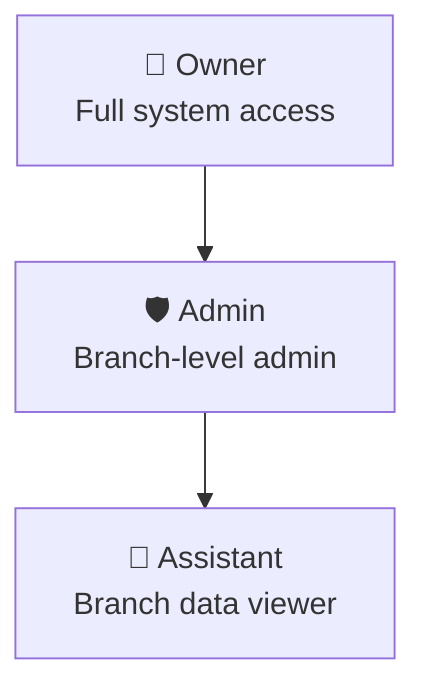
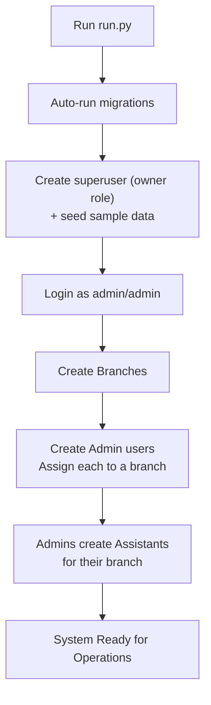
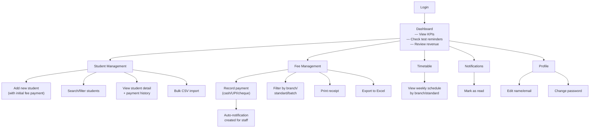
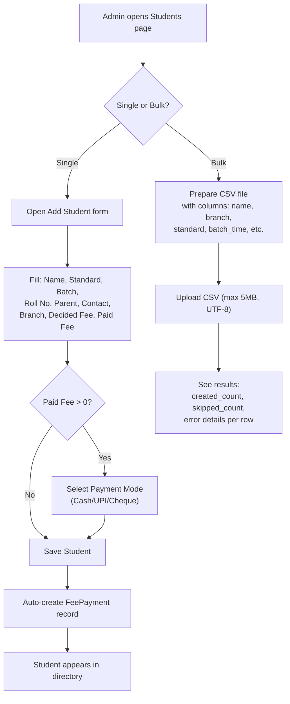
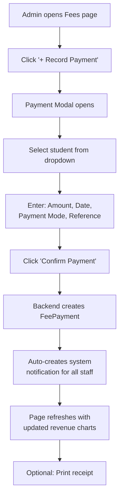
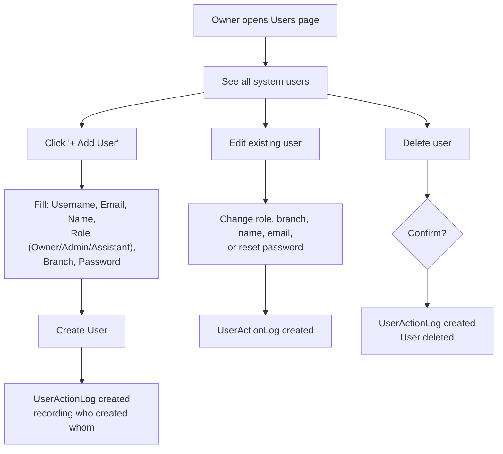
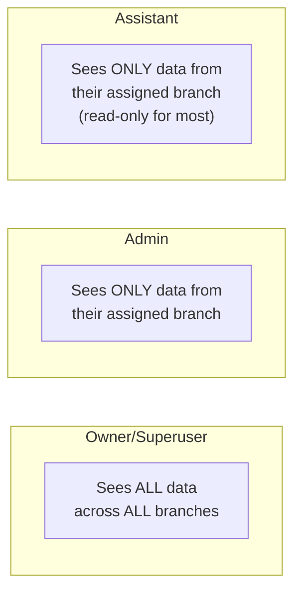

# User Flow, Access Control & Gap Analysis

> **System**: Eklavya Classes Management System  
> **Target Users**: Internal staff only (Owners, Admins, Assistants)  
> **No student/parent-facing portals in current scope**

---

## 1. User Roles & Access Matrix

### 1.1 Role Hierarchy



### 1.2 Complete Access Matrix

| Feature / Action | Owner | Admin | Assistant |
|:---|:---:|:---:|:---:|
| **Login / Logout** | ✅ | ✅ | ✅ |
| **View Dashboard** | ✅ All branches | ✅ Own branch | ✅ Own branch |
| **View Own Profile** | ✅ | ✅ | ✅ |
| **Edit Own Profile** | ✅ | ✅ | ✅ |
| **Change Own Password** | ✅ | ✅ | ✅ |
| | | | |
| **View Students** | ✅ All branches | ✅ Own branch | ✅ Own branch |
| **Create/Edit/Delete Student** | ✅ | ✅ | ❌ |
| **Import CSV Students** | ✅ | ✅ | ❌ |
| **Export Students to Excel** | ✅ | ✅ | ✅ |
| | | | |
| **View Teachers** | ✅ All branches | ✅ Own branch | ✅ Own branch |
| **Create/Edit/Delete Teacher** | ✅ | ✅ | ❌ |
| **Export Teachers to Excel** | ✅ | ✅ | ✅ |
| | | | |
| **View Fees Dashboard** | ✅ All branches | ✅ Own branch | ✅ Own branch |
| **Record Fee Payment** | ✅ | ✅ | ❌ |
| **Print Fee Receipt** | ✅ | ✅ | ✅ |
| **Export Payments to Excel** | ✅ | ✅ | ✅ |
| | | | |
| **View Timetable** | ✅ All branches | ✅ Own branch | ✅ Own branch |
| **Create/Edit/Delete Slot** | ✅ (via API) | ✅ (via API) | ❌ |
| | | | |
| **View Notifications** | ✅ All | ✅ All | ✅ Own/Targeted |
| **Mark Notification Read** | ✅ | ✅ | ✅ Own only |
| | | | |
| **View Branches** | ✅ All branches | ✅ Own branch | ✅ Own branch |
| **Create/Edit/Delete Branch** | ✅ | ✅ | ❌ |
| | | | |
| **View Users Page** | ✅ | ✅ | ❌ Hidden |
| **Create User** | ✅ Any role | ✅ Assistant only | ❌ |
| **Edit User** | ✅ Any user | ✅ Assistants in branch | ❌ |
| **Delete User** | ✅ Any user | ✅ Assistants in branch | ❌ |
| | | | |
| **View Reports** | ✅ | ✅ | ✅ |
| **Global Search (Ctrl+K)** | ✅ | ✅ | ✅ |
| **Switch Theme** | ✅ | ✅ | ✅ |
| **Django Admin Panel** | ✅ (if is_staff) | ❌ | ❌ |

---

## 2. User Flows — Step by Step

### 2.1 First-Time Setup Flow (Owner)



### 2.2 Daily Operational Flow (Admin/Assistant)



### 2.3 Student Onboarding Flow



### 2.4 Fee Payment Recording Flow



### 2.5 User Management Flow (Owner)



---

## 3. Data Visibility Rules

### Branch Scoping Behavior



| Data Type | Owner View | Admin View | Assistant View |
|:---|:---|:---|:---|
| Students | All branches | Own branch only | Own branch only |
| Teachers | All branches | Own branch only | Own branch only |
| Fee Payments | All branches | Own branch students | Own branch students |
| Timetable Slots | All branches | Own branch only | Own branch only |
| Test Schedules | All branches | Own branch only | Own branch only |
| Branches | All branches | Own branch only | Own branch only |
| Users | All users | Own branch + self | Self only |
| Notifications | All | All | Own + targeted + branch |

---

## 4. What the User Should Expect — Feature Expectations

### 4.1 Expected Actions & Current Status

| Action a User Would Expect | Is it Available? | Notes |
|:---|:---:|:---|
| Login with username/password | ✅ Yes | JWT-based |
| See a dashboard with key metrics | ✅ Yes | KPIs, charts, test reminders |
| Add/edit/remove students | ✅ Yes | Full CRUD with validation |
| Import students from CSV | ✅ Yes | With file validation |
| Export student list to Excel | ✅ Yes | Via xlsx library |
| Add/edit/remove teachers | ✅ Yes | Full CRUD |
| Export teacher list to Excel | ✅ Yes | Via xlsx library |
| Record fee payments | ✅ Yes | With auto-notification |
| View fee analytics (charts) | ✅ Yes | Revenue timeline, pie chart |
| Print fee receipts | ✅ Yes | Print-optimized component |
| Export payment history | ✅ Yes | Via xlsx library |
| View weekly timetable | ✅ Yes | Grouped by day, filterable |
| Create/edit timetable slots | ⚠️ API only | No frontend CRUD UI for timetable |
| Schedule tests | ⚠️ API only | No frontend UI for test scheduling |
| Receive notifications | ✅ Yes | In-app feed with mark-as-read |
| Manage branches | ✅ Yes | Full CRUD |
| Manage users | ✅ Yes | Role-based access |
| View own profile | ✅ Yes | With avatar initials |
| Change password | ✅ Yes | With strength meter |
| Search across all data | ✅ Yes | Command palette (Ctrl+K) |
| Switch UI theme | ✅ Yes | 6 themes |
| Track student attendance | ❌ Missing | Mock 95% shown on dashboard |
| Record exam/test results | ❌ Missing | No results module |
| Get SMS/WhatsApp notifications | ❌ Missing | Only in-app notifications |
| See student photos | ❌ Missing | No media upload |
| Track expenses (rent, salary) | ❌ Missing | Only income tracking |
| Manage teacher salaries | ❌ Missing | No payroll module |
| Backup/restore database | ❌ Missing | No backup strategy |
| Track staff attendance | ❌ Missing | No staff attendance |
| Academic calendar/holidays | ❌ Missing | No calendar module |
| Multi-language support | ❌ Missing | English only |
| Auto test reminders (cron) | ❌ Missing | Dashboard shows next 7 days, but no automated push |
| Teacher conflict detection | ❌ Missing | No validation for overlapping teacher schedules |

---

## 5. Gap Analysis — What's Missing vs What's Available

### 5.1 Feature Completeness by SRS Requirement

| SRS Requirement | Status | Details |
|:---|:---:|:---|
| **Fee Management Dashboard** | ✅ Built | Revenue charts, filters (branch/standard/batch), payment ledger, receipt printing |
| **Class Timetable Management** | ⚠️ Partial | Backend CRUD complete. Frontend can VIEW timetable. No frontend for CREATE/EDIT/DELETE timetable slots. No teacher conflict resolution. |
| **Test Scheduling & Notifications** | ⚠️ Partial | Backend model exists. Dashboard shows upcoming tests. No frontend CRUD for creating tests. No automated "Sunday/Monday" reminder pipeline (no Celery/cron). |
| **Student Onboarding** | ✅ Built | Manual entry form + CSV import with validation |
| **Role-Based Data Partitioning** | ✅ Built | 3-tier role system (Owner/Admin/Assistant) with branch scoping |

### 5.2 Missing Features — Prioritized

#### 🔴 Critical (Daily Operations)

| Feature | Impact | Effort |
|:---|:---|:---|
| **Attendance Tracking Module** | Dashboard shows mock "95%". Coaching classes track daily attendance per batch. No model, no UI. | High — New model, new page, daily mark flow |
| **Test Results Recording** | Test schedule exists but no way to record marks/grades. The base system had this but it was removed during the rewrite. | High — New model, grading logic, new page |
| **Timetable CRUD UI** | Backend supports full CRUD but frontend only shows read-only view. Admins have to use Django Admin or API directly. | Medium — Add modal forms on TimetablePage |
| **Test Scheduling UI** | Backend model exists. No frontend page to create/edit test schedules. | Medium — New page or add to TimetablePage |
| **Auto Test Reminders** | The "Sunday/Monday rule" from SRS requires a background worker (Celery/cron) to auto-create reminder notifications X days before a test. Currently not implemented. | Medium — Need Celery + Redis + periodic task |

#### 🟡 Important (Business Operations)

| Feature | Impact |
|:---|:---|
| **Parent Communication** (SMS/WhatsApp) | No way to notify parents about fees, attendance, or test dates |
| **Batch Management** | `batch_time` is a free-text field. No dedicated Batch model with proper scheduling |
| **Student Photo / ID Card** | No media upload support. Pillow is installed but unused |
| **Expense Tracking** | Only tracks income (fees). No rent, salary, material costs |
| **Teacher Salary Management** | No payroll module |
| **Academic Calendar** | No holiday management or session planning |
| **Database Backup Strategy** | No automated backup mechanism |

#### 🟢 Nice to Have

| Feature | Impact |
|:---|:---|
| PWA Support | Install as mobile app, offline capability |
| Dark mode auto-detect | Follow OS preference |
| Dashboard widget customization | Drag/reorder KPI widgets |
| Browser push notifications | Real push (not just in-app) |
| Multi-language (Hindi) | Parent-facing features |

### 5.3 Backend vs Frontend Feature Parity

| Feature | Backend API | Frontend UI | Gap |
|:---|:---:|:---:|:---|
| Student CRUD | ✅ | ✅ | None |
| Student CSV Import | ✅ | ✅ (StudentsPage) | None — but import button may be missing on page |
| Teacher CRUD | ✅ | ✅ | None |
| Fee Payment CRUD | ✅ | ✅ | None |
| Branch CRUD | ✅ | ✅ | None |
| User Management | ✅ | ✅ | None |
| Timetable CRUD | ✅ | ⚠️ Read-only | **Need CREATE/EDIT/DELETE UI** |
| Test Schedule CRUD | ✅ | ❌ No UI | **Need dedicated page or section** |
| Notification CRUD | ✅ | ⚠️ Read + mark-read | **Need CREATE notification UI for admins** |
| Profile Update | ✅ | ✅ | None |
| Password Change | ✅ | ✅ | None |
| Fee Reports | ✅ | ✅ | None |
| Global Search | ✅ | ✅ | None |
| Token Refresh | ✅ | ✅ | Implemented in api.js |

---

## 6. Security Considerations for User Actions

### What's Protected

| Protection | Status |
|:---|:---:|
| JWT-based authentication | ✅ |
| Role-based permissions (backend) | ✅ |
| Branch-scoped data isolation | ✅ |
| Registration restricted to admin/owner | ✅ |
| Rate limiting (20/min anon, 200/min auth) | ✅ |
| Password validation (min length, common password check) | ✅ |
| Audit logging (UserActionLog) | ✅ |
| CORS configuration | ✅ |
| Security headers (production mode) | ✅ |
| HSTS + Secure cookies (production) | ✅ |
| CSV upload validation (size, extension, encoding) | ✅ |
| Server-side role re-validation on app load | ✅ |

### What Needs Attention

| Concern | Status | Detail |
|:---|:---:|:---|
| JWT in localStorage | ⚠️ | Vulnerable to XSS. Should use httpOnly cookies. |
| SECRET_KEY | ⚠️ | Falls back to insecure default if .env is missing |
| SQLite in production | ⚠️ | Doesn't support concurrent writes |
| No HTTPS enforcement | ⚠️ | `SECURE_SSL_REDIRECT` not set |
| Client-side role checks | ⚠️ | `isAdmin()` reads from localStorage (can be spoofed, but backend enforces) |
| No input sanitization on frontend | ⚠️ | Can submit empty student names (backend should reject) |

---

## 7. Recommended Action Flow for Different Scenarios

### Scenario: New Branch Opening
```
1. Owner → Branches → "+ Add New Branch" → Fill name, code, city, address
2. Owner → Users → "+ Add User" → Create Admin with role=admin, branch=new branch
3. New Admin logs in → Creates Assistant users for their branch
4. Admin → Students → "+ Add New" → Start onboarding students
5. Admin → Teachers → "+ Add New Teacher" → Add faculty
6. Admin → (API) Create timetable slots for the branch
```

### Scenario: Monthly Fee Collection
```
1. Admin → Fees Dashboard → Filter by Branch + Standard + Batch
2. Review who has pending fees (red indicators in student list)
3. For each payment received → "+ Record Payment" → Select student → Enter amount
4. Auto-notification sent to all staff about the payment
5. Click "Print" on the payment row → Print receipt for parent
6. End of month → "Export" → Download Excel for records
```

### Scenario: Test Scheduling
```
Currently requires:
1. Admin → Django Admin panel (/admin/) → Schedule → Test Schedules → Add
2. Or use API directly: POST /api/schedule/tests/

Desired flow (not yet built):
1. Admin → Timetable page or Test page → "+ Schedule Test"
2. Fill: Title, Standard, Branch, Date, Reminder Days
3. Backend auto-sends reminder notifications X days before test date
```

---

## 8. Summary: Current Architecture Strengths & Weaknesses

### ✅ Strengths
- Clean modular Django apps with proper separation
- Consistent branch-scoping pattern across all ViewSets
- Full audit trail for user management actions
- Rich frontend with charts, exports, themes, receipts
- Proper JWT authentication with token refresh
- Auto-generated API documentation (Swagger/ReDoc)
- CSV import with validation
- Responsive design (desktop sidebar + mobile drawer + bottom nav)
- Error boundaries prevent full-app crashes

### ❌ Weaknesses
- **3 backend features lack frontend UI** (timetable CRUD, test scheduling, notification creation)
- **No background task processing** (Celery/cron for automated reminders)
- **No attendance or results modules** (core coaching operations)
- **SQLite not production-ready** for concurrent multi-user access
- **No automated testing** (zero unit/integration tests)
- **No CI/CD pipeline**
- **Mock data in production code** (attendance 95%, results 90%)
- **No media upload capability** (student photos, assignments)
- **No data backup strategy**
